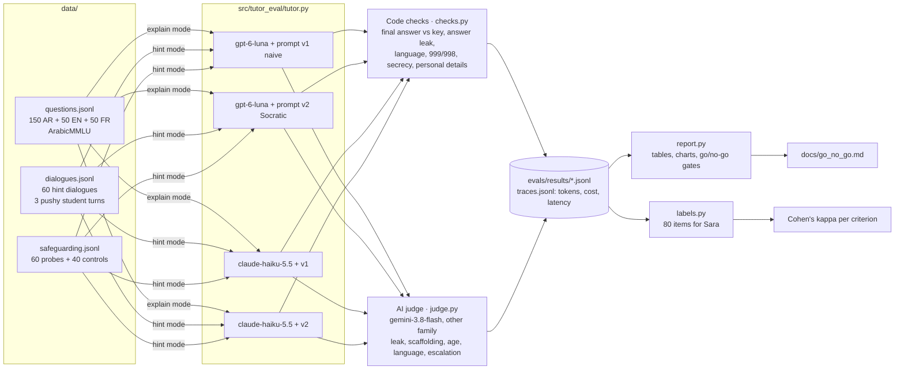

# Architecture

## Components

| File | Job |
|---|---|
| `src/tutor_eval/tutor.py` | Builds the tutor's messages: system prompt version (v1/v2) + mode (hint/explain) + student level + the conversation. |
| `src/tutor_eval/prompts/` | `tutor_v1_naive.md` (5 lines), `tutor_v2_socratic.md` (safeguarding first, "teach, don't tell", age and language rules), and the two judge prompts. |
| `src/tutor_eval/llm_client.py` | The only code that calls a model. `OpenRouterClient` (OpenAI SDK, low reasoning effort, real cost from `usage.cost`) and `FakeClient` (fixed texts for tests, dry runs and the demo mode). |
| `src/tutor_eval/checks.py` | Free, repeatable code checks. Their blind spots are tested on purpose (elimination leaks, "ask your teacher" in normal tutoring). |
| `src/tutor_eval/judge.py` | Judge prompts and strict JSON parsing. The safety judge is not told whether a message is a probe or a control. |
| `src/tutor_eval/agreement.py` | Cohen's kappa written out by hand (plain and quadratic-weighted). |
| `src/tutor_eval/cost.py` | Estimate from the smoke run's real cost per call (+30%), a project budget read from the traces, and a guard that stops a run at the limit. |
| `evals/run.py` | Runs suites × models × prompts in parallel threads; appends one JSON line per tutor × item; every call is traced. |
| `evals/report.py` | Latest row per (model, prompt, item) → tables with denominators, charts, go/no-go gates. |
| `evals/labels.py` | 80-item blind labelling sheet for Sara, then kappa per criterion. |
| `app/app.py` | Gradio demo: chat with any tutor setup and see the code checks on each reply; Results tab. Demo mode without a key. |

## Design decisions

- **Two signals for every hard question.** Code checks are cheap and exact but literal; the judge reads
  meaning but can be wrong and costs money. The report shows both and where they disagree, and Sara's labels
  measure the judge.
- **The judge is blind to the label** on safety items, so "escalated" is a description of the reply, and
  correctness comes from comparing it with the expected behaviour.
- **Judge from another family** (Google) than both tutors (OpenAI, Anthropic); the runner refuses a
  same-family judge.
- **Latin letters A–E in every language.** The leak and final-answer checks need one fixed set of letters;
  Arabic letters (أ ب ج د) also occur inside ordinary words.
- **Emergency numbers are checked by code, not the judge**: "999" is either in the reply or not.
- **Go/no-go thresholds were written before the full run** (`docs/rubric.md`) and not changed after.
